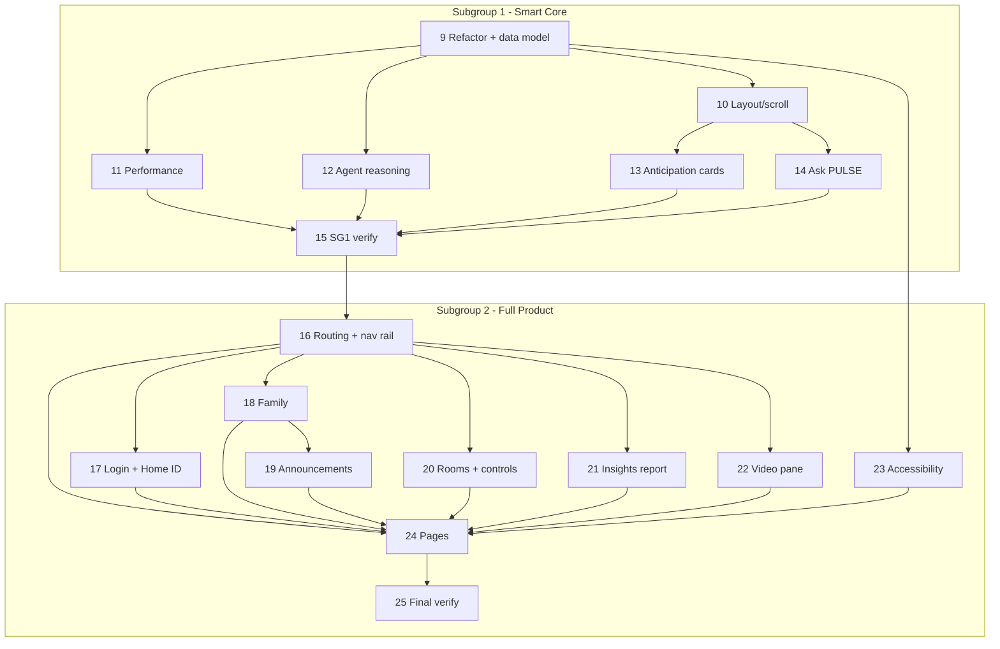

# Implementation Plan: PULSE Smart Home Dashboard

## Overview

Phase 1 delivered the ambient dashboard. The remaining work is split into two validated subgroups. **Subgroup 1 (Smart Core)** turns the current page into a fast, polished, anticipatory, conversational dashboard — a strong standalone demo. After validation, **Subgroup 2 (Full Product)** expands it into a coherent multi-page product (Home ID + login, nav rail, rooms/family/insights/automations/settings) with household-depth features. All work stays front-end and backend-ready; live Bedrock wiring comes later.

## Tasks

### Phase 1 — Base dashboard (complete)

- [x] 1. Scaffold Vite + React project with Tailwind and Framer Motion
- [x] 2. Build theme foundation and layout shell
- [x] 3. Define all component state and the event pipeline
- [x] 4. Implement Household Rhythm Timeline
- [x] 5. Implement The Acoustic Pulse centerpiece
- [x] 6. Implement Reasoning Engine terminal
- [x] 7. Implement Intervention Cards shelf
- [x] 8. Verify build and run dev server

### Subgroup 1 — Smart Core (build first, then validate)

- [x] 9. Refactor into modules and expand the central data model
  - Split PulseDashboard.jsx into components/, data/, hooks/ (no visual change); move state + controller into usePulseController
  - Seed data: Home ID, family members, rooms, appliances (room/type/controls/online), energy/savings, notifications, announcements, anticipation items, `agent` field on reasoning entries
  - Generalize controller to handleSensoryTrigger(type, payload); keep handleAcousticTrigger as a wrapper
  - _Requirements: 7.1, 7.2, 7.3_

- [x] 10. Fixed-viewport layout with per-pane scrolling
  - Outer h-screen overflow-hidden; each pane scrolls its own content; page never scrolls; subtle scrollbar styling
  - _Requirements: 2.2, 2.3, 2.4_

- [x] 11. Performance optimization pass (no visual regression)
  - Animate only transform/opacity; CSS keyframes for spectrum bars; fewer blur layers; will-change/content-visibility; prefers-reduced-motion
  - _Requirements: 4.3_

- [x] 12. Agent-attributed reasoning
  - Render an `agent` tag per reasoning line ([KitchenAgent]/[EnergyAgent]/[SecurityAgent]), color-coded; seed demo entries
  - _Requirements: 5.2, 5.3_

- [x] 13. "PULSE Predicts" anticipation cards
  - A panel showing upcoming AI actions before they happen, with Approve / Snooze; state-driven (anticipation items)
  - Demonstrates "anticipates, not responds" — the problem-statement centerpiece
  - _Requirements: 7.2_

- [x] 14. "Ask PULSE" conversational bar
  - Natural-language command/query input with mocked, explainable responses streamed into the reasoning terminal
  - _Requirements: 5.3, 7.2_

- [x] 15. Subgroup 1 verification
  - Build clean, no diagnostics, dev server renders; triggers spike wave + stream logs + flash cards; panes scroll independently; anticipation + Ask PULSE work
  - _Requirements: 1.1_

### Subgroup 2 — Full Product (after Subgroup 1 validation)

- [x] 16. App shell: routing + persistent left icon nav rail (React Router)
- [x] 17. Home ID + login / member-select screen (demo PIN)
- [x] 18. Family / Household members panel (avatar, name, relationship, age, presence)
- [x] 19. Household Announcements / Intercom (any member broadcasts to all; feed + spoken-by-PULSE stub)
- [x] 20. Rooms + per-device controls with manual override / undo
- [x] 21. Home Insights Report (clean summary: ₹ saved, energy, water-motor, power-cut handling, routine adherence)
- [x] 22. Sensory video pane (audio + video fusion via handleSensoryTrigger; mic/camera indicators)
- [x] 23. Accessibility & preferences (reduced-motion + larger-text toggles, ARIA, focus states)
- [x] 24. Pages composition: Rooms, Family, Insights, Automations, Settings (Dashboard stays the hero)
- [x] 25. Final verification

## Task Dependency Graph

## Notes

- Most important first: Subgroup 1 fixes lag + space and adds the intelligence/anticipation/conversation that define the demo.
- Sequential execution within each subgroup (shared layout/shell); build-verified after each task.
- No backend calls added; state-driven with `// TODO: Wire API connection to Python/AWS Bedrock endpoint here` seams preserved/extended.
- Visual identity (obsidian + copper glassmorphism, accent palette) preserved throughout.
